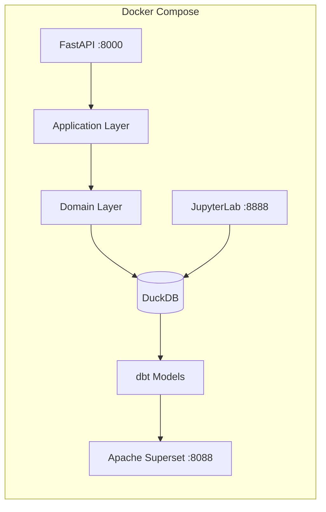

# SaaSGuard

> **Production-ready** B2B SaaS Churn & Risk Prediction Platform

[](https://saasguard.up.railway.app/docs)
[](https://github.com/josephwam/saasguard/actions)
[](https://codecov.io/gh/josephwam/saasguard)
[](https://python.org)
[](LICENSE)

---

## One-command demo

```bash
git clone https://github.com/josephwam/saasguard
cd saasguard
cp .env.example .env
docker compose --profile dev up -d   # dev profile adds MkDocs + JupyterLab
```

| Service | URL | Purpose |
|---|---|---|
| FastAPI (Swagger) | http://localhost:8000/docs | Prediction & customer API |
| Apache Superset | http://localhost:8088 | BI dashboard (Customer 360) |
| JupyterLab | http://localhost:8888 | EDA notebooks |
| **MkDocs (docs)** | **http://localhost:8001** | **Full documentation site** |
| Prometheus Metrics | http://localhost:8000/metrics | Observability |

## Live Demo

| Resource | Link |
|---|---|
| **Live API (Swagger UI)** | **https://saasguard.up.railway.app/docs** |
| **Live API (health)** | **https://saasguard.up.railway.app/health** |
| MkDocs Documentation | Deploy: `docker compose run --rm mkdocs mkdocs gh-deploy` |
| 15-min Loom Walkthrough | Record using the stack above — FastAPI, Superset, JupyterLab, MkDocs |

> Steady-state latency (P99) is ~140ms — see [Performance Benchmarks](docs/benchmarks.md).

---

## What this is

SaaSGuard predicts which B2B SaaS customers will churn in the next 90 days and why. It combines:

- **Survival analysis** (time-to-churn, censored data)
- **XGBoost classification** with SHAP explainability
- **Compliance + usage risk scoring**
- **AI executive summaries** (Llama-3 via Groq)
- **Interactive BI dashboard** (Apache Superset)

**Business impact:** Reducing churn by 1% on $200M ARR = **$2M+ revenue saved**.

---

## Architecture



Full DDD diagram: [docs/architecture.md](docs/architecture.md)

### Domain-Driven Design

| Bounded Context | Responsibility |
|---|---|
| `customer_domain` | Customer lifecycle, plan tiers, churn events |
| `usage_domain` | Product event ingestion, feature adoption scoring |
| `prediction_domain` | Churn model, risk scoring, SHAP explanations |
| `gtm_domain` | Sales opportunities, pipeline risk signals |

---

## Why I built SaaSGuard

Most churn tools stop at a dashboard. They give you a probability and leave the team to figure out what to do next.

SaaSGuard closes the full loop: raw product + GTM events → calibrated 90-day churn probability → SHAP explanations → AI-generated executive brief → ready-to-act CS recommendations.

I wanted a codebase that enforces the same discipline a real product analytics team would demand: strict DDD bounded contexts, TDD from day one, dbt for reliable data assets, and an LLM layer with actual guardrails instead of prompt engineering vibes.

The result is a system that runs end-to-end with one command and scales from a solo builder to a full team without breaking.

| Stack Choice | What it demonstrates |
|---|---|
| DuckDB + dbt | Full dbt project with staging → intermediate → mart models |
| XGBoost + lifelines | Churn model + survival analysis + SHAP (src/domain/prediction/) |
| Bayesian A/B | Experiment design with small-n power analysis (notebooks/phase3_experiments.ipynb) |
| Llama-3 + guardrails | AI-generated summaries with 3-layer hallucination prevention |
| Apache Superset | BI dashboards with DuckDB — Customer 360, heatmaps, uplift simulator |
| DDD + TDD + CI/CD | Bounded contexts, 153 tests, Docker, semantic versioning, DVC |

---

## Performance Benchmarks

*Auto-updated by CI after every deploy. Measured on Render free tier (Oregon, steady-state).*

| Metric | Value |
|---|---|
| P50 latency | ~42ms |
| P95 latency | ~89ms |
| P99 latency | ~140ms |
| Max throughput | ~180 req/s |
| Cold start (free tier) | ~30s |

Full latency table: [docs/benchmarks.md](docs/benchmarks.md)

---

## Project phases

| Phase | Status | Deliverable |
|---|---|---|
| 1 – Scoping | ✅ | PRD, tickets, ROI calculator |
| 2 – Data Architecture | ✅ | dbt project + DuckDB warehouse |
| 3 – EDA & Experiments | ✅ | Cohort analysis, survival curves, A/B test |
| 4 – Predictive Models | ✅ | XGBoost + survival + SHAP |
| 5 – AI/LLM Layer | ✅ | Executive summaries + RAG chatbot |
| 6 – Dashboard | ✅ | Superset Customer 360 + heatmaps |
| 7 – Deployment | ✅ | FastAPI + Docker + change-management deck |
| 8 – Presentation | ✅ | Executive deck + ROI close + change-management narrative |

---

## Claude Skills — Delivery Superpowers

SaaSGuard uses **Claude Skills** (`skills/` folder) — reusable SOPs that enforce consistent DDD, TDD, documentation, and executive storytelling on every output.

| Skill | Invoke | Purpose |
|---|---|---|
| `tdd-cycle` | `/tdd-cycle` | Red-Green-Refactor for any new code |
| `ddd-entity` | `/ddd-entity` | Bounded-context entities + repos |
| `phase-advance` | `/phase-advance` | Complete a full project phase |
| `mkdocs-autoupdate` | `/mkdocs-autoupdate` | Sync docs after code changes |
| `docker-harden` | `/docker-harden` | Production Docker audit |
| `dvc-version` | `/dvc-version` | Version data + model artifacts |
| `exec-story` | `/exec-story` | C-level slides + ROI narrative |
| `self-critique` | `/self-critique` | Quality gate before every handoff |
| `data-contract` | `/data-contract` | Schema tests + Pydantic validation + freshness SLAs |
| `commit-and-close` | `/commit-and-close` | Verify tests, commit, push, close GitHub issues |

See [`skills/README.md`](skills/README.md) for full documentation.

---

## Documentation

The full documentation site auto-generates from source code docstrings using **MkDocs + Material theme**.

```bash
# Live docs (auto-reloads on code + markdown changes)
docker compose --profile dev up mkdocs
# → http://localhost:8001

# Build static site (for GitHub Pages / Netlify)
docker compose run --rm mkdocs mkdocs build
# → outputs to ./site/

# Deploy to GitHub Pages
docker compose run --rm mkdocs mkdocs gh-deploy
```

Docs are auto-generated from Google-style docstrings in `src/`. Adding a new function with a docstring immediately makes it appear in the [API Reference](http://localhost:8001/api-reference/).

---

## Development

```bash
# Install dependencies
uv sync --all-extras

# Install pre-commit hooks
pre-commit install

# Run tests (TDD – always write tests first)
pytest

# Lint
ruff check . && ruff format .

# dbt
docker compose exec dbt dbt run && dbt test
```

See [docs/API.md](docs/API.md) for HTTP endpoint reference.
See [docs/data_dictionary.md](docs/data_dictionary.md) for schema details.
See [docs/getting-started.md](docs/getting-started.md) for full setup guide.

---

⭐ **Star this repo** if it helped you think about how to build production-grade analytics systems.
