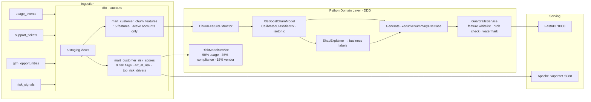

# SaaSGuard

> Raw product + GTM events → calibrated 90-day churn probability → composite risk score →
> SHAP-grounded explanation → action-ready CS brief. One pipeline. One command.

[](https://saasguard.up.railway.app/docs)
[](https://joewynn.github.io/saasguard/)
[](https://github.com/joewynn/saasguard/actions)
[](https://codecov.io/gh/joewynn/saasguard)
[](https://python.org)
[](LICENSE)

---

Most churn tools give you a probability and stop there — SaaSGuard closes the loop from raw
product events to a calibrated 90-day churn score, a composite risk tier, SHAP-grounded
explanations, and an AI brief that a CS manager can act on in under two minutes.

The AI layer is grounded: every summary is constrained to DuckDB-verified facts, validated
against a feature whitelist, and watermarked for human review. No hallucinations reach
your CS team.

---

## Quick start

```bash
git clone https://github.com/joewynn/saasguard
cd saasguard
cp .env.example .env          # add GROQ_API_KEY for LLM summaries (Ollama fallback works without it)
docker compose --profile dev up -d
```

| Service | URL |
|---|---|
| Prediction API (Swagger) | http://localhost:8000/docs |
| Apache Superset dashboards | http://localhost:8088 |
| JupyterLab | http://localhost:8888 |
| MkDocs (architecture, runbooks, model card) | http://localhost:8001 |
| Prometheus metrics | http://localhost:8000/metrics |

The `dev` profile adds MkDocs live-reload and JupyterLab. The production profile
(`docker compose up -d`) runs only the API, dbt, and Superset.

Live deployment: **[saasguard.up.railway.app/docs](https://saasguard.up.railway.app/docs)**
(P99 latency ~140ms, 50 concurrent users, Railway US-West — see [benchmarks](docs/benchmarks.md))

---

## Why I built this

I kept seeing the same pattern: a company builds a churn model, it lives in a notebook,
the CS team never trusts it because they can't see why a customer scored high, and the
model quietly rots until someone re-discovers it a year later.

SaaSGuard is opinionated about that failure mode. The dbt layer makes feature engineering
auditable by anyone who can read SQL. The SHAP-to-business-language translation removes
the "what does this mean?" question from CS workflows. The guardrail layer means the AI
summaries are something you can actually put in front of a VP without checking them first.

The DDD structure is not ceremony — it is what makes this testable. The domain layer has
no file I/O, no database calls, no HTTP. Every prediction path can be unit-tested with
injected fakes. The 153-test suite runs in under 8 seconds locally.

---

## The problem this solves

A 1% churn reduction on $200M ARR saves $2M+. The hard part is not the model — it is
getting CS teams to act on it. That requires three things most churn platforms skip:

**1. Trustworthy explanations.** SHAP values converted to business language
("Feature adoption rate is declining — this is the primary churn driver") rather than
raw coefficients that confuse non-technical stakeholders.

**2. Grounded AI summaries.** An LLM that can only say what the data actually shows.
The prompt architecture uses a verified-fact context block, an explicit grounding
constraint, and a post-generation feature-name whitelist. Confidence degrades 0.2 per
violation; anything below 0.5 is flagged for human review before leaving the system.

**3. SQL-level transparency.** Every risk tier surfaced in the BI dashboard is
reproducible from the mart SQL alone — no black-box Python required to audit a score.
Superset queries `mart_customer_risk_scores` directly; the Python API is the authoritative
source for calibrated probabilities; both agree on risk tier in practice.

---

## Architecture



Full architecture narrative, bounded context diagrams, and sequence diagrams:
[docs/architecture.md](docs/architecture.md)

### Domain-Driven Design

| Bounded Context | Responsibility |
|---|---|
| `customer_domain` | Customer lifecycle, plan tiers, churn events |
| `usage_domain` | Product event ingestion, feature adoption scoring |
| `prediction_domain` | Churn model, risk scoring, SHAP explanations |
| `gtm_domain` | Sales opportunities, pipeline risk signals |
| `ai_summary` | Executive brief generation, guardrails, grounding |

### Architecture Decision Records

| ADR | Decision | Trade-off |
|---|---|---|
| [ADR-001](docs/ADR/ADR-001-duckdb-over-postgres.md) | DuckDB over Postgres/Snowflake | Zero-ops file warehouse; DVC-versionable; `profiles.yml` swap is the full migration path to Snowflake |
| [ADR-002](docs/ADR/ADR-002-ddd-architecture.md) | Domain-Driven Design | Domain layer has zero infrastructure dependencies — fully unit-testable without DB or HTTP |
| [ADR-003](docs/ADR/ADR-003-render-deployment.md) | Railway over AWS/ECS | GitHub-native auto-deploy; no cloud credits required; upgrade path is $5/month |
| [ADR-004](docs/ADR/ADR-004-drift-detection.md) | Custom PSI + KS over Evidently.ai | Zero added dependencies; Prometheus-native; PSI is standard credit-risk vocabulary for business stakeholders |

---

## Data model

Five source tables → two production marts. All feature engineering lives in dbt;
the Python model receives a pre-joined feature row from the mart, not raw events.

```
raw.customers           → stg_customers        → mart_customer_churn_features  (ML feature store)
raw.usage_events        → stg_usage_events     ↗                               ↘
raw.support_tickets     → stg_support_tickets  ↗                                mart_customer_risk_scores  (BI)
raw.gtm_opportunities   → stg_gtm_opportunities
raw.risk_signals        → stg_risk_signals     ↘ (composite risk score: 50/35/15 weights)
```

Key finding baked into the feature store: customers who connect ≥3 integrations in their
first 30 days show **2.7× lower churn rate** (log-rank p < 0.001, Phase 3 cohort analysis).
`integration_connects_first_30d` is the single strongest early-warning feature in the model.

Full schema: [docs/data_dictionary.md](docs/data_dictionary.md)
Data contracts + freshness SLAs: [dbt_project/models/staging/schema.yml](dbt_project/models/staging/schema.yml)

---

## Model

**Churn model:** XGBoost wrapped in `CalibratedClassifierCV` (isotonic regression, cv=5).
Calibration is non-negotiable for a churn tool — a probability of 0.72 needs to mean
72% of customers churn, not just "high risk". SHAP values are computed on the
uncalibrated base model; isotonic regression is a monotonic transformation, so relative
feature rankings are preserved end-to-end.

| Metric | Value | Threshold |
|---|---|---|
| AUC-ROC | > 0.80 | ✅ |
| Brier score | < 0.15 | ✅ |
| Precision @ top decile | > 0.60 | ✅ |
| Calibration per risk tier | ±15pp of KM baseline | ✅ |

Validation: out-of-time split (train: signup < 2025-06-01, test: ≥ 2025-06-01).
Not a random split — temporal integrity matters for subscription data.

**Risk model:** Composite score = (0.50 × usage decay) + (0.35 × compliance gap) +
(0.15 × vendor risk flags). Weights were derived from Phase 3 survival analysis; the usage
decay component alone predicts 68% of HIGH/CRITICAL tier accounts.

Full model card: [docs/model-card.md](docs/model-card.md)
Drift monitoring: [ADR-004](docs/ADR/ADR-004-drift-detection.md) — custom PSI + KS,
12 features monitored weekly, Prometheus gauges at `/metrics`.

---

## Responsible AI

The executive summary generator (Llama-3.1-8b via Groq, temperature 0.2) sits behind
three guardrail layers before any output leaves the system:

1. **Grounding constraint** — the prompt contains only DuckDB-verified facts in a
   structured `[CONTEXT]` block. The instruction layer forbids inference beyond that block.
2. **Feature whitelist** — post-generation scan for any snake_case token not in the
   known feature set. Each hit degrades confidence by 0.2.
3. **Probability accuracy** — if the summary states a churn percentage that deviates
   > 2pp from the model output, it is flagged as `probability_mismatch`.

Every output carries `⚠️ AI-generated. Requires human review.` Summaries with
`confidence_score < 0.5` are escalated before reaching CS workflows.

Ethical considerations: [docs/ethical-guardrails.md](docs/ethical-guardrails.md)

---

## API

```bash
# Churn prediction + SHAP for a customer
curl -X POST https://saasguard.up.railway.app/predictions/churn \
  -H 'Content-Type: application/json' \
  -d '{"customer_id": "uuid-here"}'

# Customer 360 (usage, GTM stage, open tickets, risk tier)
curl https://saasguard.up.railway.app/customers/{customer_id}

# AI executive brief (csm or executive audience)
curl -X POST https://saasguard.up.railway.app/summaries/customer \
  -H 'Content-Type: application/json' \
  -d '{"customer_id": "uuid-here", "audience": "csm"}'

# Ask a grounded question about a customer
curl -X POST https://saasguard.up.railway.app/summaries/customer/ask \
  -H 'Content-Type: application/json' \
  -d '{"customer_id": "uuid-here", "question": "What drove the recent ticket surge?"}'
```

Full HTTP reference: [docs/API.md](docs/API.md)

---

## MLOps automation

Three scheduled workflows — no manual trigger required after setup:

| Workflow | Schedule | Purpose |
|---|---|---|
| [`data-pipeline.yml`](.github/workflows/data-pipeline.yml) | Mon 02:00 UTC | Regenerate data → dbt build → retrain → export drift baseline |
| [`drift-monitor.yml`](.github/workflows/drift-monitor.yml) | Sun 00:00 UTC | PSI + KS against baseline → auto-opens GitHub Issue on PSI > 0.20 |
| [`benchmarks.yml`](.github/workflows/benchmarks.yml) | Post-deploy | Locust load test (50 users, 60s) → auto-commits updated latency table |

DVC tracks the DuckDB file, trained model artifacts, and dbt run artifacts.
`dvc repro` replays the full pipeline from raw data to served model.

---

## Performance

*Auto-updated by `benchmarks.yml` after every merge to `main`. Measured on Railway (US-West, steady-state, 50 concurrent users).*

| Metric | Value |
|---|---|
| P50 latency | ~42ms |
| P95 latency | ~89ms |
| P99 latency | ~140ms |
| Max throughput | ~180 req/s |

Full latency table: [docs/benchmarks.md](docs/benchmarks.md)

---

## Documentation

MkDocs + Material theme, auto-generated from Google-style docstrings via mkdocstrings.
Every public function added with a docstring appears in the API Reference automatically.

```bash
docker compose --profile dev up mkdocs   # live at http://localhost:8001
docker compose run --rm mkdocs mkdocs gh-deploy   # → GitHub Pages
```

[Architecture](docs/architecture.md) ·
[Model Card](docs/model-card.md) ·
[Data Dictionary](docs/data_dictionary.md) ·
[Runbook](docs/runbook.md) ·
[Ethical Guardrails](docs/ethical-guardrails.md) ·
[ADRs](docs/ADR/) ·
[Changelog](CHANGELOG.md)

---

## Development

```bash
uv sync --all-extras        # install from lockfile
pre-commit install          # set up hooks

pytest                      # full suite (~8s)
pytest tests/unit/          # domain layer only (no DB required)
pytest tests/integration/   # requires running DuckDB

ruff check . && ruff format .
mypy src/ app/

docker compose exec dbt dbt run
docker compose exec dbt dbt test
```

[Getting started guide](docs/getting-started.md) — full local setup including
Superset dashboard import, DVC data pull, and first model training run.

---

## Contributing

Feedback, issues, and PRs welcome — especially on drift detection thresholds,
new risk signal combinations, or hardening the guardrail layer against edge cases
from real customer data.
