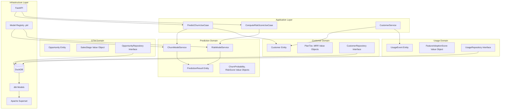
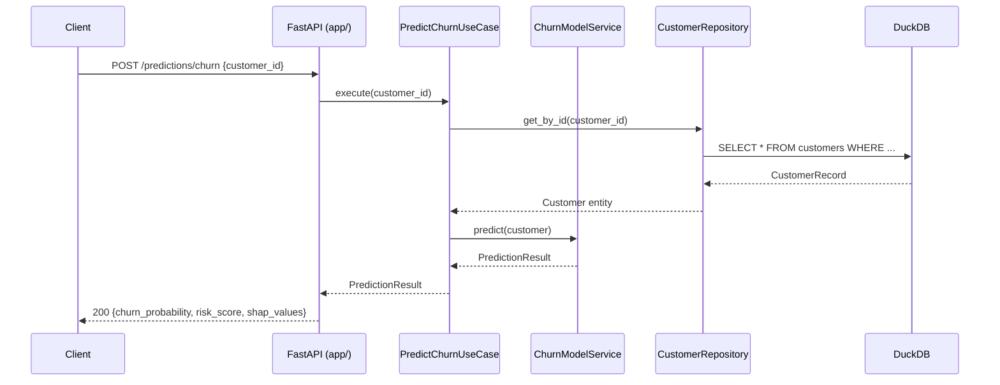

# Architecture

SaaSGuard follows Domain-Driven Design (DDD) with a hexagonal (ports & adapters) structure. The domain layer has zero infrastructure dependencies.

## Domain Contexts

## Request Flow

## Folder → Layer Mapping

| Folder | DDD Layer | Rule |
|---|---|---|
| `src/domain/` | Domain | No imports from infra or app. Pure Python. |
| `src/application/` | Application | Orchestrates domain objects. No DB calls. |
| `src/infrastructure/` | Infrastructure | Implements repository interfaces. DB/ML/HTTP. |
| `app/` | Delivery (API) | Thin layer. Calls application services only. |
| `dbt_project/` | Infrastructure | SQL transformations over DuckDB. |
