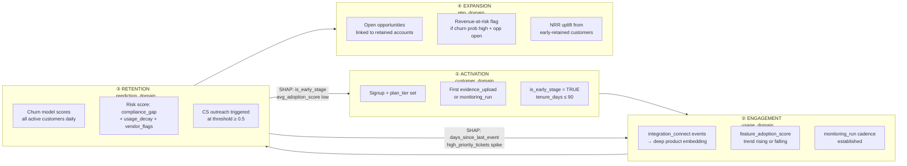
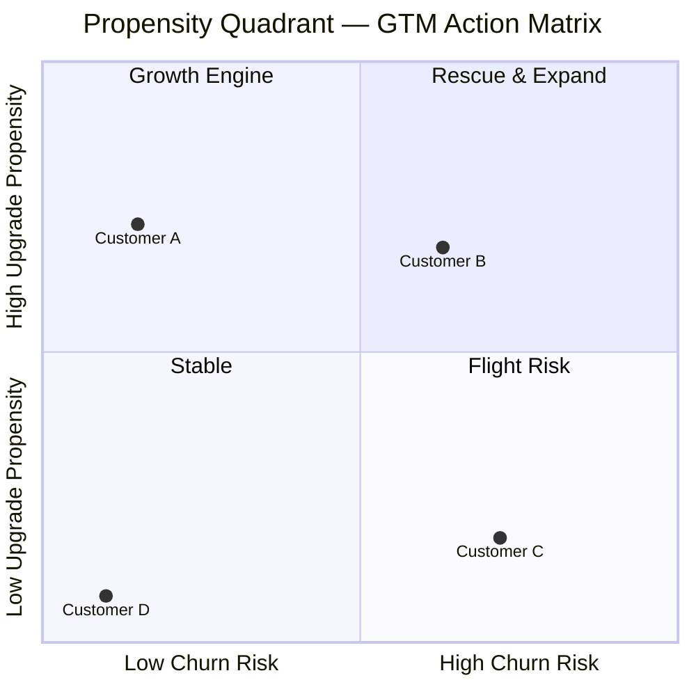

# Growth Analytics Framework — SaaSGuard

Maps the customer lifecycle to the four bounded contexts in SaaSGuard's DDD architecture, grounding each stage in real VoC evidence.

---

## Framework Diagram

---

## Stage Definitions & Evidence

### Stage 1: Activation — `customer_domain`

**Definition:** Customer goes from signed contract to first meaningful product outcome.

**Critical window:** First 90 days (`is_early_stage = TRUE`). This is where 20–25% of voluntary churn originates.

**Real VoC evidence:**
> *"Getting started felt a bit nebulous, and there's limited direction on where to focus first."*
> — Secureframe user, G2 reviews

> *"Vanta lacked engagement and guidance — left us managing our SOC audit manually."*
> — Vanta user, via 6clicks.com verified review analysis, 2025

**Leading metric:** First `evidence_upload` or `monitoring_run` event within 14 days of signup.
**Churn signal:** No activation event in first 14 days → `is_early_stage` + low `feature_adoption_score` → top SHAP driver.

---

### Stage 2: Engagement — `usage_domain`

**Definition:** Customer establishes a recurring usage pattern. Depth (integrations) matters more than breadth (page views).

**Critical signals:**
- `integration_connect` event: strongest single retention signal — customers who connect ≥3 integrations in first 30 days have dramatically lower churn
- `monitoring_run` cadence: weekly runs → healthy; gaps >14 days → early decay signal
- `feature_adoption_score` trend: rising = expanding use; flat or declining = disengagement

**Real VoC evidence:**
> *"Some integrations felt clunky and required extra effort to set up or troubleshoot, which slowed down the process."*
> — Vanta user, Complyjet verified reviews, 2025

> *"Most of the tools I've used export .csv files for their 'evidence' and no auditor I've talked to will accept them — they want screenshots."*
> — GRC practitioner, Reddit r/netsec, collected via CyberSierra, 2024

**Leading metric:** `retention_signal_count` (integration_connect + api_call + monitoring_run events in first 30 days).

---

### Stage 3: Retention — `prediction_domain`

**Definition:** Customer successfully renews. SaaSGuard's core intervention point.

**Model inputs from prior stages:**
- From Activation: `tenure_days`, `is_early_stage`, `avg_adoption_score`
- From Engagement: `events_last_30d`, `days_since_last_event`, `retention_signal_count`
- From Support: `tickets_last_30d`, `high_priority_tickets`
- From Risk: `compliance_gap_score`, `vendor_risk_flags`

**Real VoC evidence:**
> *"The alert system has been described as overwhelming at times. Users get alarm fatigue and end up ignoring most notifications."*
> — 6clicks.com verified Vanta review analysis, 2025

> *"84% of B2B software buyers cite excellent customer support when deciding on renewals."*
> — Serpsculpt B2B Retention Statistics, 2025

**KPI:** CS intervention conversion rate (target: ≥40% of outreaches result in confirmed retention).

---

### Stage 4: Expansion — `gtm_domain` + `expansion` bounded context

**Definition:** Retained customer upgrades plan tier, adds seats, or buys additional frameworks.

**SaaSGuard's expansion propensity module (v0.9.0):**

The expansion bounded context adds a second propensity model — `P(upgrade in 90 days)` — giving GTM teams a prioritised, signal-driven expansion pipeline. Combined with the churn model, it produces the **Propensity Quadrant**.

#### Propensity Quadrant Diagram

#### Conflict Matrix — Churn × Expansion → GTM Action

| Churn risk | Upgrade propensity | Quadrant | GTM Action |
|---|---|---|---|
| Low (< 0.40) | High (≥ 0.25) | **Growth Engine** | Book expansion call; AE-led |
| High (≥ 0.40) | High (≥ 0.25) | **Rescue & Expand** | CS retention play first; AE holds |
| High (≥ 0.40) | Low (< 0.25) | **Flight Risk** | Immediate CS intervention; no expansion |
| Low (< 0.40) | Low (< 0.25) | **Stable** | Nurture / self-serve; low-touch |

#### Tier Ladder with Uplift Multipliers

| Current tier | MRR range | Next tier | ARR multiplier | Expected uplift (mean MRR) |
|---|---|---|---|---|
| Starter | $500–$2K | Growth | 3.0× | ~$18K ARR per convert |
| Growth | $2K–$8K | Enterprise | 5.0× | ~$120K ARR per convert |
| Enterprise | $8K–$50K | Custom | 1.2× | ~$50K ARR per seat expand |

**Real VoC evidence:**
> *"Companies with formal customer success teams retain customers at higher rates, with firms having dedicated CSMs seeing up to 25% higher NRR than those without."*
> — Benchmarkit / Vitally, 2025

> *"The first 30–90 days after signup are the most important in defining account lifetime value — customers retained past 90 days expand at 3× the rate of those who nearly churned."*
> — Churnfree, B2B SaaS Benchmarks 2026

**Leading metrics:**
- `upgrade_propensity ≥ 0.25` AND `churn_probability < 0.40` → Growth Engine (expansion call)
- Top-10% propensity decile: ~$1.2M captured ARR at 25% conversion rate
- Open `gtm_opportunities` with `opportunity_type = expansion` linked to customers with `churn_probability < 0.25`

---

## Metrics by Stage

| Stage | Input metric | Target | Owned by |
|---|---|---|---|
| Activation | % customers with first event ≤14 days | >80% | Product / CS |
| Engagement | % customers with ≥3 integrations in 30 days | >60% | Product |
| Retention | Churn probability AUC-ROC | ≥0.85 | Data Science |
| Retention | CS intervention conversion rate | ≥40% | CS |
| Expansion | Open opps for churn-safe customers (prob < 0.25) | >70% of pipeline | GTM |

---

## Sources

- [B2B Customer Retention Statistics 2025 — Serpsculpt](https://serpsculpt.com/b2b-customer-retention-statistics/)
- [Understanding Vanta's Limitations — 6clicks](https://www.6clicks.com/resources/blog/understanding-vantas-limitations-insights-from-real-user-experiences)
- [Vanta Review 2025 — Complyjet](https://www.complyjet.com/blog/vanta-reviews)
- [Top GRC Platforms 2025 — CyberSierra](https://cybersierra.co/blog/top-grc-platforms-2025/)
- [Drata vs. Vanta vs. Secureframe — Silent Sector](https://silentsector.com/blog/drata-vs-vanta-secureframe)
