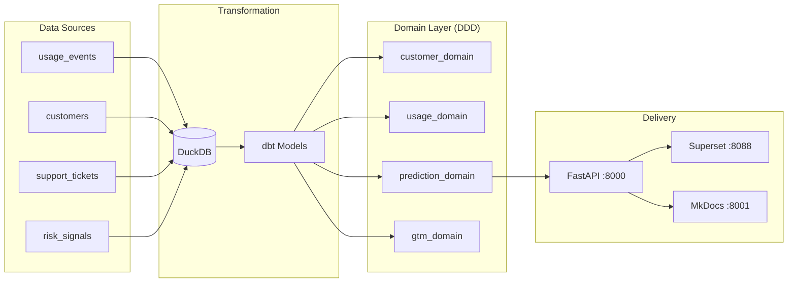

# SaaSGuard

> **Production-grade** B2B SaaS churn and compliance risk prediction platform.

[](https://github.com/joewynn/SaaSGuard/actions)
[](https://python.org)
[](https://github.com/joewynn/SaaSGuard/blob/main/LICENSE)

---

## What is SaaSGuard?

SaaSGuard ingests product usage, CRM, and support data to answer one high-value question:

> **Which customers will churn in the next 90 days — and why?**

It combines survival analysis, XGBoost classification, SHAP explainability, and an AI executive summary layer to give Customer Success teams the right signal at the right time.

**Business impact:** Reducing churn by 1% on $200M ARR = **$2M+ revenue saved annually**.

---

## The Problem (Voice-of-Customer)

| Pain Point | Source | Impact |
|---|---|---|
| "Initial onboarding could be more guided" | G2 Reviews | 20–25% churn in first 90 days |
| "More manual input than expected" | Forrester | Integration abandonment → churn |
| "Very difficult to reach them when you have a problem" | Industry surveys | Reactive CS → preventable churns |
| "80% of B2B buyers switch when expectations aren't met" | SaaS industry reports | Poor activation → early exit |

SaaSGuard attacks each of these by surfacing the right signal early enough to act.

---

## Quick Demo

```bash
git clone https://github.com/joewynn/SaaSGuard
cd SaaSGuard
cp .env.example .env
docker compose --profile dev up -d
```

| Service | URL | Purpose |
|---|---|---|
| FastAPI | [localhost:8000/docs](http://localhost:8000/docs) | Prediction & customer API |
| Superset | [localhost:8088](http://localhost:8088) | BI dashboard (Customer 360) |
| JupyterLab | [localhost:8888](http://localhost:8888) | EDA notebooks |
| **MkDocs** | [localhost:8001](http://localhost:8001) | **This documentation site** |

---

## Architecture at a Glance



Full DDD diagram with request flow → [Architecture](architecture.md).

---

## Engineering principles

Four constraints shaped every architectural decision, documented formally in the ADRs above.

**Auditability over convenience.** Feature engineering lives in dbt SQL, not Python.
Every risk tier surfaced in a dashboard is reproducible from `mart_customer_risk_scores`
alone — no Python runtime required. CS and Compliance teams can audit a score without
reading model code.

**Calibration is non-negotiable.** `CalibratedClassifierCV` (isotonic, cv=5) ensures a
predicted probability of 0.72 corresponds to a 72% historical churn rate in that decile.

**Grounded AI, not generative AI.** The executive summary layer is constrained to
DuckDB-verified facts. The `GuardrailsService` checks every output against a feature
whitelist and the model's probability output. Confidence degrades 0.2 per violation.

**Zero-dependency domain layer.** `src/domain/` has no file I/O, no database calls, and
no HTTP dependencies. Every prediction path is fully unit-testable with injected fakes.
The 153-test suite completes in under 8 seconds locally.
