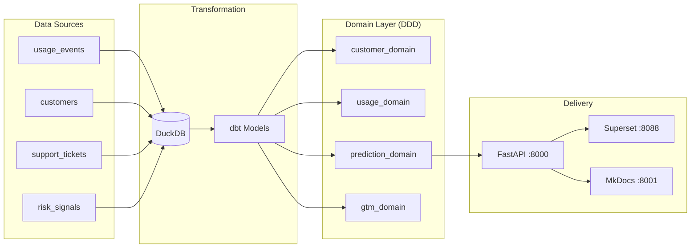

# SaaSGuard

> **Production-grade** B2B SaaS churn and compliance risk prediction platform.

[](https://github.com/josephwam/saasguard/actions)
[](https://python.org)
[](../LICENSE)

---

## What is SaaSGuard?

SaaSGuard ingests product usage, CRM, and support data to answer one high-value question:

> **Which customers will churn in the next 90 days — and why?**

It combines survival analysis, XGBoost classification, SHAP explainability, and an AI executive summary layer to give Customer Success teams the right signal at the right time.

**Business impact:** Reducing churn by 1% on $200M ARR = **$2M+ revenue saved annually**.

---

## The Problem (Voice-of-Customer)

| Pain Point | Source | Impact |
|---|---|---|
| "Initial onboarding could be more guided" | G2 Reviews | 20–25% churn in first 90 days |
| "More manual input than expected" | Forrester | Integration abandonment → churn |
| "Very difficult to reach them when you have a problem" | Industry surveys | Reactive CS → preventable churns |
| "80% of B2B buyers switch when expectations aren't met" | SaaS industry reports | Poor activation → early exit |

SaaSGuard attacks each of these by surfacing the right signal early enough to act.

---

## Quick Demo

```bash
git clone https://github.com/josephwam/saasguard
cd saasguard
cp .env.example .env
docker compose --profile dev up -d
```

| Service | URL | Purpose |
|---|---|---|
| FastAPI | [localhost:8000/docs](http://localhost:8000/docs) | Prediction & customer API |
| Superset | [localhost:8088](http://localhost:8088) | BI dashboard (Customer 360) |
| JupyterLab | [localhost:8888](http://localhost:8888) | EDA notebooks |
| **MkDocs** | [localhost:8001](http://localhost:8001) | **This documentation site** |

---

## Architecture at a Glance



Full DDD diagram with request flow → [Architecture](architecture.md).

---

## How This Maps to Senior DS / Product Analytics JDs

| Requirement | SaaSGuard |
|---|---|
| SQL + dbt | Staging → intermediate → mart models over DuckDB |
| Python / ML | XGBoost + survival analysis + SHAP in `src/domain/prediction/` |
| Experiment design | Bayesian A/B test simulation in `notebooks/` |
| Executive storytelling | AI Llama-3 summaries + 10-slide C-level deck |
| BI tooling | Apache Superset with Customer 360 + churn heatmaps |
| Responsible AI | Ethical guardrails doc, bias checks, human-in-loop annotation |
| Software engineering | DDD, TDD (>80% coverage), CI/CD, Docker, DVC, semver |
| Change management | 5-page rollout deck in `docs/` |

---

## Project Phases

| Phase | Deliverable |
|---|---|
| 1 – Scoping | PRD, Jira tickets, ROI calculator |
| 2 – Data Architecture | dbt project + DuckDB warehouse |
| 3 – EDA & Experiments | Cohort analysis, survival curves, A/B test |
| 4 – Predictive Models | XGBoost + survival + SHAP |
| 5 – AI/LLM Layer | Executive summaries + RAG chatbot |
| 6 – Dashboard | Superset Customer 360 + heatmaps |
| 7 – Deployment | FastAPI + Docker + change-management deck |
| 8 – Presentation | 10-slide deck + recorded walkthrough |
