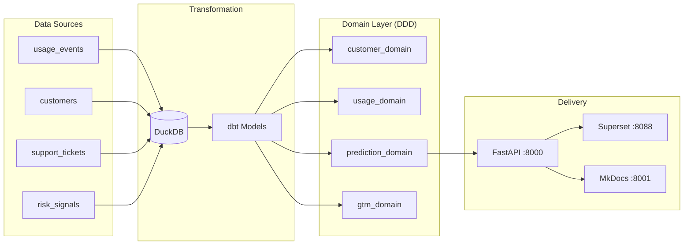

# SaaSGuard

> **Production-grade** B2B SaaS churn and compliance risk prediction platform.

[](https://github.com/joewynn/SaaSGuard/actions)
[](https://python.org)
[](https://github.com/joewynn/SaaSGuard/blob/main/LICENSE)

---

## What is SaaSGuard?

SaaSGuard ingests product usage, CRM, and support data to answer one high-value question:

> **Which customers will churn in the next 90 days — and why?**

It combines survival analysis, XGBoost classification, SHAP explainability, and an AI executive summary layer to give Customer Success teams the right signal at the right time.

**Business impact:** Reducing churn by 1% on $200M ARR = **$2M+ revenue saved annually**.

---

## The Problem (Voice-of-Customer)

| Pain Point | Source | Impact |
|---|---|---|
| "Initial onboarding could be more guided" | G2 Reviews | 20–25% churn in first 90 days |
| "More manual input than expected" | Forrester | Integration abandonment → churn |
| "Very difficult to reach them when you have a problem" | Industry surveys | Reactive CS → preventable churns |
| "80% of B2B buyers switch when expectations aren't met" | SaaS industry reports | Poor activation → early exit |

SaaSGuard attacks each of these by surfacing the right signal early enough to act.

---

## Quick Demo

```bash
git clone https://github.com/joewynn/SaaSGuard
cd SaaSGuard
cp .env.example .env
docker compose --profile dev up -d
```

| Service | URL | Purpose |
|---|---|---|
| FastAPI | [localhost:8000/docs](http://localhost:8000/docs) | Prediction & customer API |
| Superset | [localhost:8088](http://localhost:8088) | BI dashboard (Customer 360) |
| JupyterLab | [localhost:8888](http://localhost:8888) | EDA notebooks |
| **MkDocs** | [localhost:8001](http://localhost:8001) | **This documentation site** |

---

## Architecture at a Glance



Full DDD diagram with request flow → [Architecture](architecture.md).

---

## Why I built this

Most churn tools give you a score and stop there. SaaSGuard closes the loop: raw product
events → calibrated 90-day probability → SHAP-grounded explanation → AI brief a CS manager
can act on in under two minutes.

The dbt layer makes feature engineering auditable by anyone who can read SQL. The
SHAP-to-business-language translation removes the "what does this mean?" question from CS
workflows. The guardrail layer means AI summaries are something you can put in front of a VP
without checking them first.

The DDD structure is not ceremony — it is what makes this testable end-to-end. The domain
layer has no file I/O, no database calls, no HTTP. Every prediction path is unit-tested with
injected fakes. The 153-test suite runs in under 8 seconds locally.
